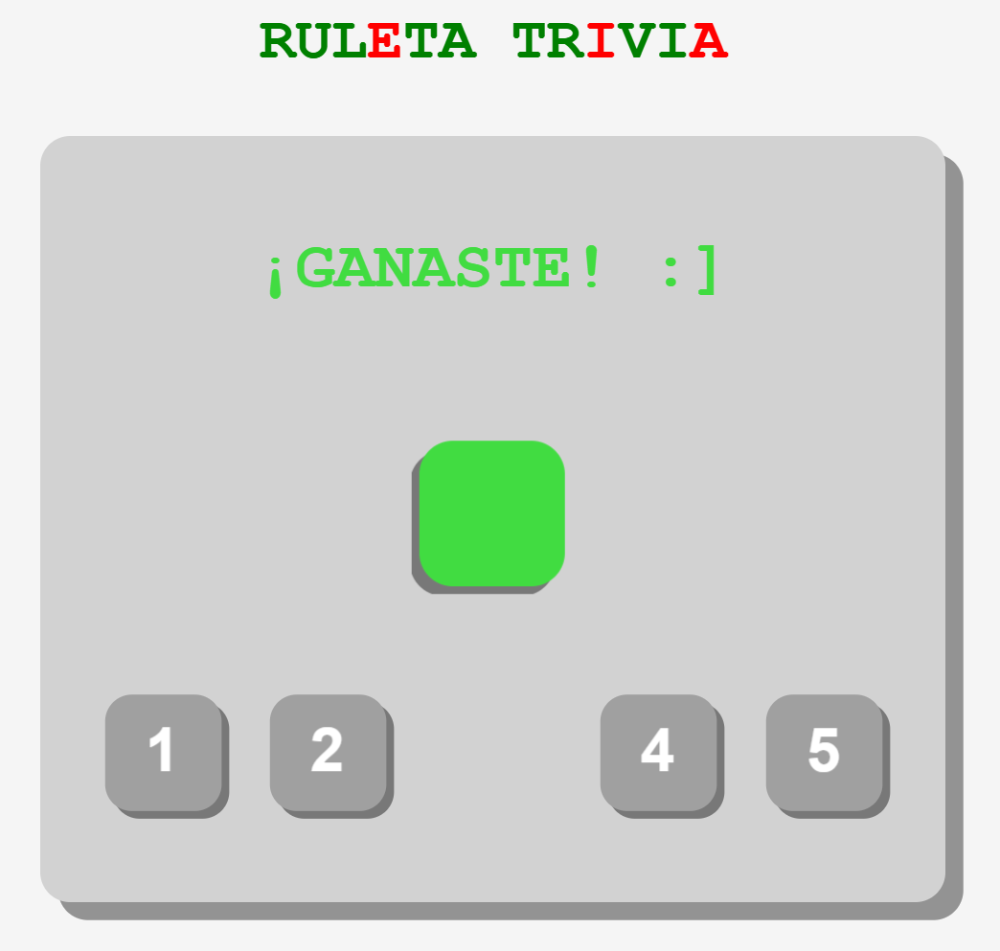

# juegoEventos
El juego consiste en un trivia de 5 preguntas.
Las preguntas para el trivia se almacenan en un array en un archivo aparte. Luego se seleccionan 5 de ellas aleatoriamente y comienza el juego.
La respuesta que seleccione el usuario en cada pregunta se detectará mediante eventos de click. 
Por cada pregunta respondida, las cartas de encima de la pregunta almacenarán el numero de aciertos y fallos durante el juego.

Una vez contestadas todas las preguntas, las cartas se darán la vuelta, se barajarán aleatoriamente y mostrarán un número. Mediante eventos, se detectará que número pulsa el jugador en su teclado, y la carta del número pulsado se dará la vuelta. Al darse la vuelta, mostrará si es una carta de fallo o de acierto, y según ese resultado, el jugador ganará o perderá.

He seguido una estética plana y minimalista, con varias animaciones, así el usuario tendrá una experiencia fluida pero no muy sobrecargada.
Todos los colores son escalas de grises distinguibles entre ellos, excepto el verde, rojo y amarillo.

Las animaciones de las cartas han dado varios problemas con el css, así que al final he tenido que mezclar animaciones y colores entre el JavaScript y css para que funcione.